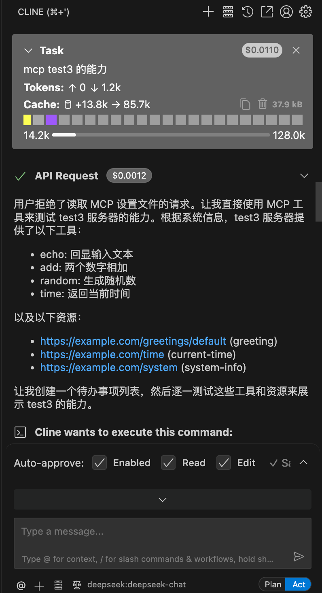

## 背景
时间 2025 年 9 月 9 日
官方 https://github.com/modelcontextprotocol/typescript-sdk 的功能完整但是对应的php-sdk却没有远程mcp服务可用并且只支持php8，
所以基于该ts仓库翻译了一版本php的版本，只实现了自己需要的streamHttp无状态的mcp服务 简单测试通过

## 使用
```sh
php -S localhost:8000 server.php
```

到cline 中配置
```json
{
  "mcpServers": {
    "your-demo": {
      "autoApprove": [],
      "disabled": false,
      "timeout": 60,
      "type": "streamableHttp",
      "url": "http://localhost:8000/mcp"
    }
  }
}
```

